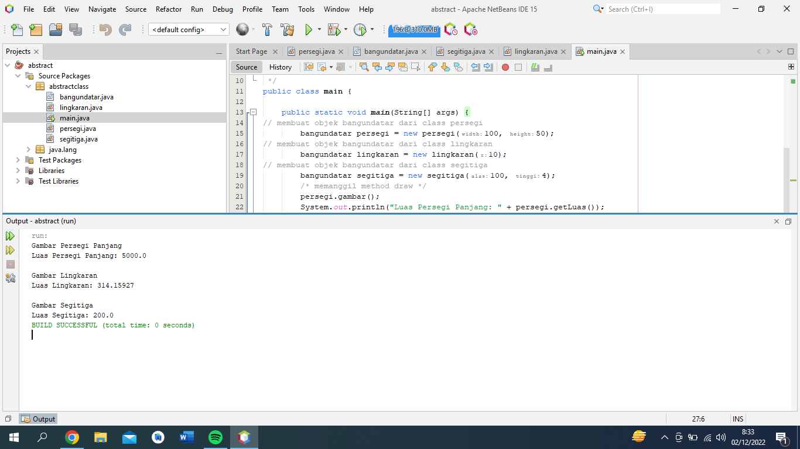

# latihanjava6
___
### Program menghitung luas dan keliling bangun datar

• Mendeklarasikan <i>class abstract bangundatar</i> yang merupakan superclass
```java 
    public abstract class bangundatar {

        private String warna;

        public void setWarna(String warna) {
            this.warna = warna;
        }

        public String getWarna() {
            return this.warna;
        }

        public abstract void gambar();

        public abstract float getLuas();
    }
```
• Mendeklarasikan <i>class lingkaran</i> yang merupakan subclass dari <i>class bangundatar</i>
```java 
        import java.lang.Math;
        public class lingkaran extends bangundatar {

            private int r;

            public lingkaran(int r) {
                this.r = r;
            }

            @Override
            public void gambar() {
                System.out.println("\nGambar Lingkaran");
            }

            @Override
            public float getLuas() {
                return (float) (Math.PI * r * r);
            }
        }
```
• Mendeklarasikan <i>class persegi</i> yang merupakan subclass dari <i>class bangundatar</i>
```java 
    public class persegi extends bangundatar {

        private float height;
        private float width;

        public persegi(int width, int height) {
            this.height = height;
            this.width = width;
        }

        @Override
        public void gambar() {
            System.out.println("Gambar Persegi Panjang");
        }

        @Override
        public float getLuas() {
            return this.width * this.height;
        }
    }
```
• Mendeklarasikan <i>class segitiga</i> yang merupakan subclass dari <i>class bangundatar</i>
```java 
    public class segitiga extends bangundatar {

        private int alas;
        private int tinggi;
        private int st;

        public segitiga(int alas, int tinggi) {
            this.alas = alas;
            this.tinggi = tinggi;
        }
        @Override
        public void gambar() {
            System.out.println("\nGambar Segitiga");
        }
        @Override
        public float getLuas() {
            return (this.alas * this.tinggi)/2;
        }
    }
```
• Mendeklarasikan <i>class main</i> yang merupakan class main
```java
        public class main {

            public static void main(String[] args) {
                // membuat objek bangundatar dari class persegi
                bangundatar persegi = new persegi(100, 50);
                // membuat objek bangundatar dari class lingkaran
                bangundatar lingkaran = new lingkaran(10);
                // membuat objek bangundatar dari class segitiga
                bangundatar segitiga = new segitiga(100, 4);
                /* memanggil method draw */
                persegi.gambar();
                System.out.println("Luas Persegi Panjang: " + persegi.getLuas());
                lingkaran.gambar();
                System.out.println("Luas Lingkaran: " + lingkaran.getLuas());
                segitiga.gambar();
                System.out.println("Luas Segitiga: " + segitiga.getLuas());
            }
        }
```
• Hasil Run

